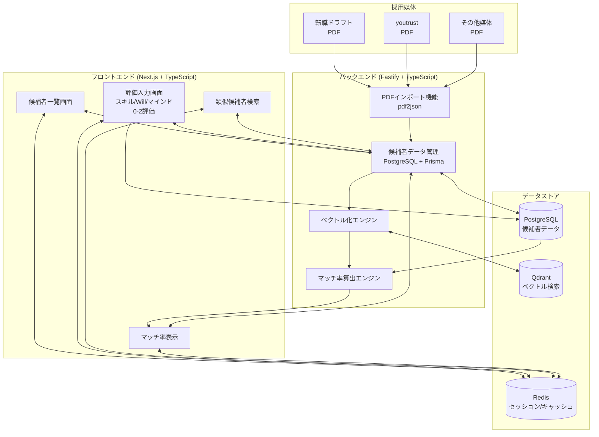
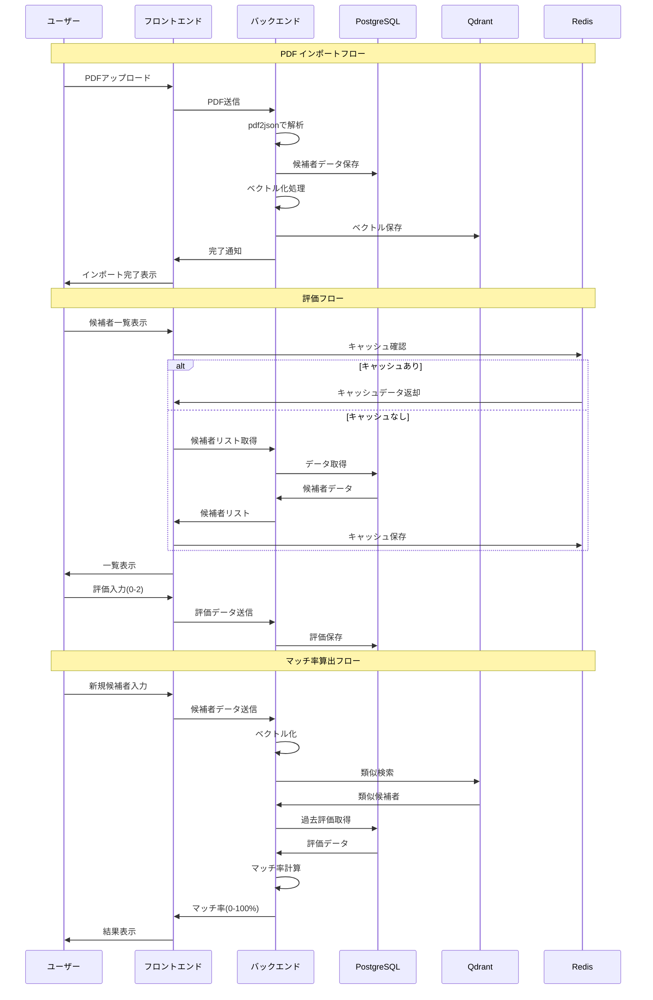
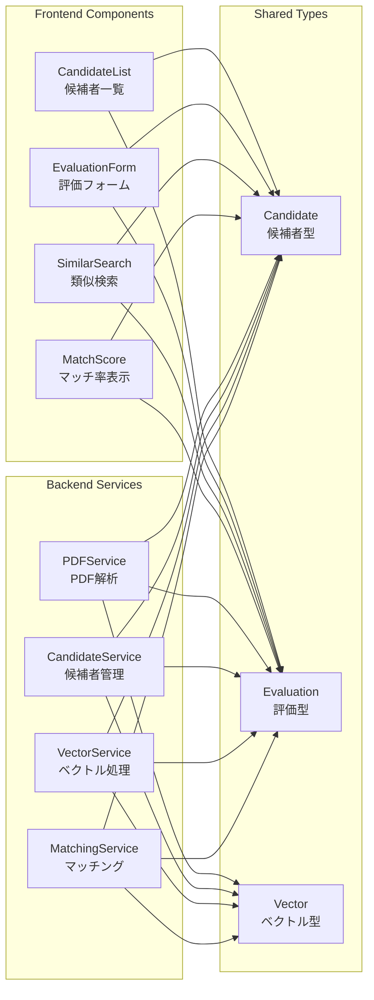

# システム概念図

## システム全体構成

## データフロー詳細

## コンポーネント関係図

## データフロー

1. **インポート**: PDF → 構造化データ → データベース保存
2. **評価**: 複数評価者 → 3値評価（スキル/Will/マインド） → 評価データ蓄積
3. **ベクトル化**: 候補者属性 → 数値ベクトル → ベクトル検索DB
4. **マッチング**: 新規候補者 → 類似検索 + 評価履歴分析 → マッチ率算出